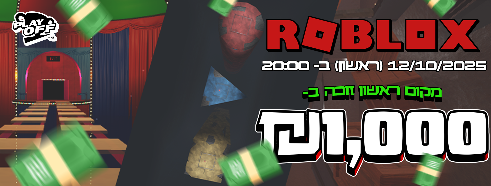

# טורניר הרובלוקס הגדול ביותר בישראל 2025

import DiscordCTA from '@site/src/components/DiscordCTA';

ביום ראשון, ה-12 באוקטובר 2025, במהלך חופשת סוכות, קהילת TeGriAi שברה שיא ישראלי וקבעה אבן דרך משמעותית בעולם הגיימינג המקומי. הקהילה אירחה את טורניר הרובלוקס הגדול ביותר שנערך אי פעם בישראל, אירוע מקוון חסר תקדים שמשך אליו 682 משתתפים והוכיח פעם נוספת את כוחה כקהילת הגיימינג הגדולה והפעילה במדינה.

הטורניר עוצב במתכונת מאתגרת של "האחרון שנשאר", אשר דרשה מהמשתתפים להפגין לא רק מיומנות טכנית אלא גם יכולות חשיבה אסטרטגית וזריזות. המשתתפים התמודדו עם סדרה של מבחנים מגוונים שנועדו לסנן את השחקנים הטובים ביותר, כאשר רק מי שהצליח לשלוט בכל סוגי האתגרים יכול היה להעפיל לגמר ולהינשא בתואר האלוף. האירוע כולו נמשך כשעתיים, שהיו מלאות במתח, אקשן ורוח ספורטיבית.

מעבר לתחרות עצמה, ההיענות המרשימה של מאות שחקנים מכל רחבי הארץ הדגישה את תפקידה המרכזי של TeGriAi כ"מקום הכי ישראלי ברשת" – מרחב המאפשר לגיימרים להתחבר, להתחרות וליצור חוויות משותפות. הצלחת הטורניר לא נמדדה רק במספר המשתתפים, אלא גם באווירה הקהילתית המיוחדת שליוותה אותו.

<DiscordCTA />

כדי להוסיף מימד של יוקרה ותחרותיות, הזוכה המאושר במקום הראשון קיבל פרס בשווי 1,000 ₪. טורניר הרובלוקס של 2025 ייזכר לא רק בזכות השיא שקבע, אלא כהפגנת כוח קהילתית וכחגיגה של תרבות הגיימינג בישראל, שנכנסה לדפי ההיסטוריה של הקהילה כאחד האירועים המוצלחים והגדולים ביותר שיזמה.