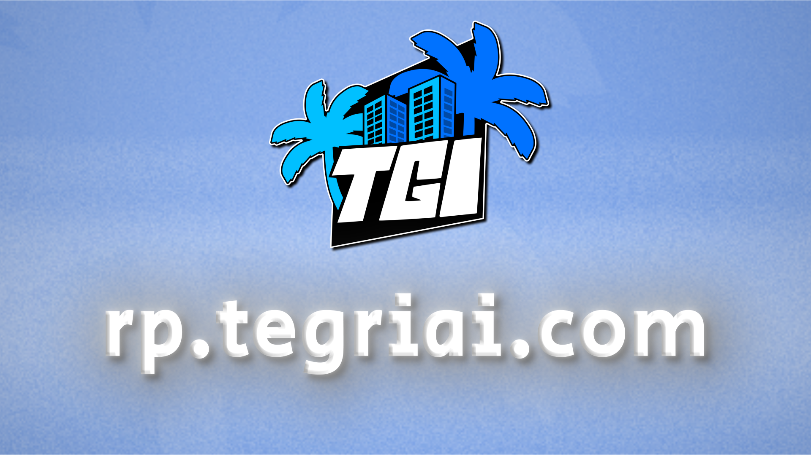
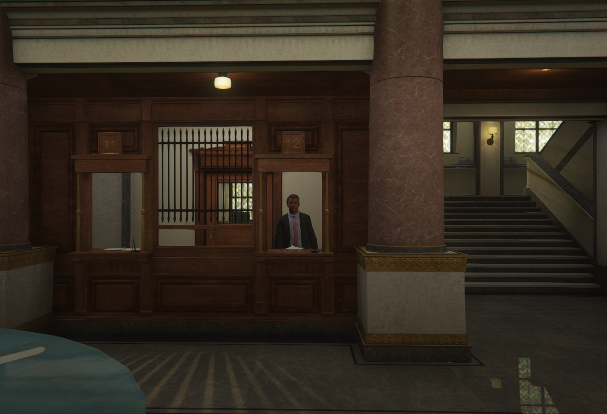
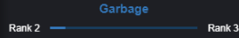

# איך להתקין FiveM ולהיכנס לשרת?
על מנת להיכנס לשרת, יש צורך להתקין את האפליקציה FiveM.
* ניתן לבצע התקנה רק לאחר שיש לכם את המשחק Grand Theft Auto V (GTA V) מותקן מלפני כן.

לקריאת המדריך הנוגע בהתקנת האפליקציה: [לחצו פה](https://wiki.tegriai.com/servers/fivem/installation)

התקנתם? מעולה!

קראו את המידע מטה על מנת להבין כיצד להיכנס לשרת.

# כיצד להיכנס לשרת?
ניתן להתחבר רק לאחר שבוצעה התקנה של האפליקציה FiveM, ויש ברשותכם רול Allowlist בשרת הדיסקורד שלנו.

_שימו לב_:
* על מנת להיכנס לשרת, יש צורך לפתוח את התוכנה Steam ברקע, לפני פתיחת האפליקציה FiveM וניסיון ההתחברות לשרת.

כאשר אתם נמצאים על החלון של האפליקציה FiveM, אתם לוחצים על המקש *F8*.
לאחר מכן, תפתח לכם שורת פקודות, שבה יש צורך לרשום:
```bash
connect rp.tegriai.com
```
*עיר אחת, אלף סיפורים.* 🩵



# איך פועלת הכלכלה בשרת?
הכלכלה בשרת נחשבת ל**כלכלה קשה**.

במטרה לתת רמת ריאליסטיות והזמן שלוקח על מנת להשיג פריטים בעלי ערך רב.

# מהן שעות קבלת מענה בטיקט תמיכה?
שעות המענה בכרטיסיית תמיכה (טיקט) משתנות בהתאם לתאריך,
אך השעות הפעילות ביותר למענה הן **10:00**-**22:00**.

_שימו לב_:
* זמני המענה גבוהים יותר בשעות מאוחרות מהרגיל, או בחגים וסופי שבוע.

# מה סגנון השרת?
השרת שלנו פועל במדינות **San Andreas**, בתוך העיר **Los Santos**.

_בתוך העיר ניתן למצוא את הארגונים הבאים_:
* EMS (Emergency Services)
* LSPD (Los Santos Police Department)
* BCSO (Blaine Country Sheriffs Office)
* SASP (San Andreas State Police)

# מעוניינים לדעת איך בודקים מה המצב עם הבחינה שלכם?
במידה ועדיין לא התקבלתם לשרת וקיבלתם רול Allowlist, על מנת לבדוק מה המצב עם בחינתכם - ניתן לכתוב הודעה לצוות בנידון בחדר "help" בשרת.

# מהו הזמן הממוצע לאישור טופס קבלה לשרת?
הזמן הממוצע למענה לאישור לשרת הוא **12 שעות**, אך במקרי עומס - זמני ההמתנה עלולים להגיע לעד **72 שעות**.

עבר הזמן שהובטח לקבלת תשובה? כתבו לנו בעזרת המדריך מעל (בדיקת מצב הבחינה שלכם).

# איך מצטרפים לתפקידי צוות בשרת?
_התפקידים האפשריים הם_:
* צוות הנהלה (לניהול השרת)
* צוות תמיכה (לעזרה בטיקטים)
* צוות תפעולי (לעזרה בטיקטים ואכיפה בתוך השרת משחק)
* צוות תכנות (לפיתוח השרת מבחינת פ'יצרים תכנותיים)
* צוות איביוקט (לפיתוח השרת מבחינת מפות ורכבים חדשים)

בשרת הדיסקורד קיים חדר בשם "recruitment", כל עוד הוא פתוח זה אומר שמתקיימת קבלה של אנשי צוות חדשים בזמן הנוכחי.

במידה ולא ניתן למצוא את החדר ואתם מחזיקים את הרול Allowlist, כנראה שאין צורך בצוות חדש בזמן הנוכחי.

_שימו לב_:
* ניתן להיבחן ולגשת לחדר שצוין מעל רק לאחר קבלת הרול Allowlist.
* רק טפסים שנענו ברצינות מלאה ובגרות יבדקו, ומעבר על החוקים בטופס עלול להוביל לזיהוי וענש.

# איך לוקחים משכורת?
במידה והתפקיד שבו אתם נמצאים (IC) מביא משכורות באיסוף מהבנק, ניתן להגיע לבנק הנקרא "הבנק הגדול".

ובתוך הבנק, לגשת ל- NPC הנראה בתמונה.

להשתמש ב**עין** שלכם (Alt), על מנת לגשת לתפריט אסיפת הכספים - ולבחור את האופציה היחידה שמופיעה בהסתכלות על הבנקאי.

(ניתן לראות את הבנקאי בתמונה מטה)



# איך הרמות בעבודות מסוג Labor עוזרות?
בכל רמה שעולים בהתקדמות ועבודה, מקבלים עם הזמן יותר ויותר **חומרים** בסוף העבודה (בממוצע).

למשל, אדם ברמה **3** יקבל כמות נמוכה משמעותית מאדם ברמה **20**.

(ניתן לראות דוגמא לרמות של העבודת Labor מסוג Garbage בתמונה מטה)



**ניתן להציע הצעות לכתיבת נושאים נוספים בעמוד זה בכל זמן בעזרת כרטיסיית תמיכה (טיקט) בשרת הדיסקורד**.

תודה על הקריאה!

- נכתב על ידי @JustMe.png באהבה 💝


