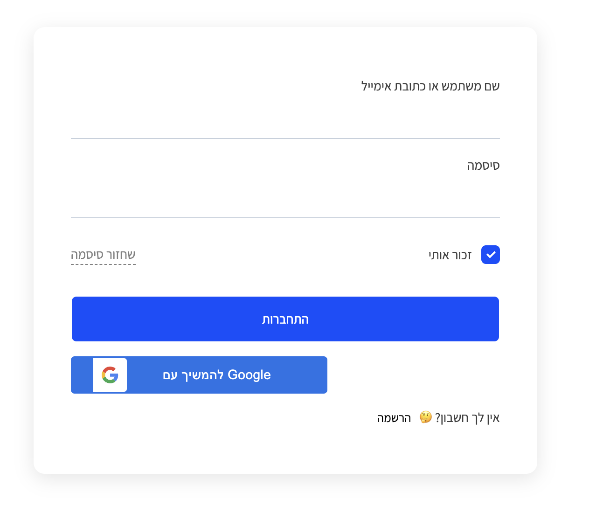

כדי ליצור חשבון בפלטפורמה, לחצו על הכפתור **"[התחברות](https://workway.co.il/login/)"** הממוקם בצד שמאל של הדף.  
הכפתור זמין בכל עמודי הפלטפורמה וניתן לזהותו בקלות.  

  

:::tip[טיפ]  
**הרשמה מהירה עם Google:**  
באפשרותכם להירשם ולהתחבר בקלות באמצעות Google.  
שימו לב: בעת התחברות עם Google, לא תוכלו לבחור שם משתמש בעצמכם.  
במידת הצורך, תוכלו לשנות זאת מאוחר יותר על ידי פנייה לצוות התמיכה שלנו.  
:::  

## שלבים ליצירת חשבון  

1. **לחצו על כפתור "התחברות":**  
   תוכלו למצוא אותו בצד שמאל של כל דפי הפלטפורמה.  

2. **לחצו על כפתור "הרשמה":**  
   לאחר מעבר למסך ההתחברות, תמצאו את כפתור "הרשמה" במסך הכניסה.  

3. **בחרו שם משתמש:**  
   השם ישמש לזיהוי שלכם בפלטפורמה.  

4. **הזינו כתובת מייל:**  
   חובה להזין כתובת מייל תקינה, כי קישור אימות יישלח אליה כדי להשלים את יצירת החשבון.  

5. **בחרו סיסמה:**  
   בחרו סיסמה חזקה ובטוחה. מומלץ להשתמש באותיות, ספרות וסימנים מיוחדים.  

6. **בחרו את סוג הפרופיל שלכם:**  
   - **פרופיל עסקי** – מיועד לעסקים או נותני שירותים.  
   - **פרופיל רגיל** – לשימוש אישי.  

7. **אשרו את תנאי הפלטפורמה:**  
   קראו ואשרו את התקנון והתנאים לשימוש בפלטפורמה.  

לאחר ביצוע השלבים הללו, חשבונכם יהיה מוכן לשימוש!  